<div align="center">
<a href="https://github.com/Cubeiic-HanXuan/cube-shell/">

</a>
</div>

<p align="center">
  <a href="./README.md">简体中文</a> |
  <a href="./README.en.md">English</a>
</p>

![Python-badge] ![License-badge] ![release-badge] ![download-badge] ![download-latest]

## cube-shell

#### 介绍

`cube-shell`是`linux` 服务器远程运维管理工具，可以代替Xshell、XSftp、MobaXterm 等工具对服务器进行管理，`cube-shell` 简洁且强大。市面上大多数ssh客户端工具都是集成了很多没有用的菜单，而且ui设计十分复杂，对于初用者不太友好。

`cube-shell`的设计初衷就是简洁且实用，没有任何多余的菜单干扰我们使用它。安装也很简单，解压不需要安装，就可以直接使用。

### cube-shell有哪些功能？
**1.设备列表**

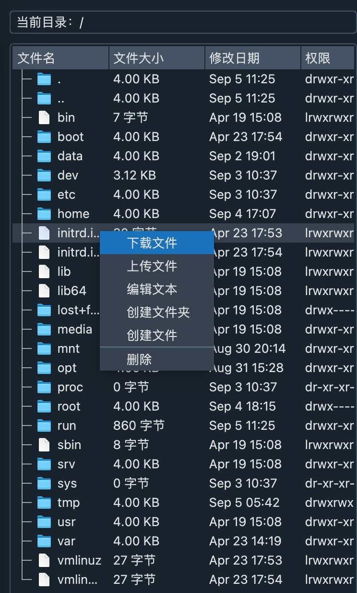

- 新增配置
- 编辑配置
- 删除配置

**2.快捷菜单栏**

每个菜单栏都支持快捷键
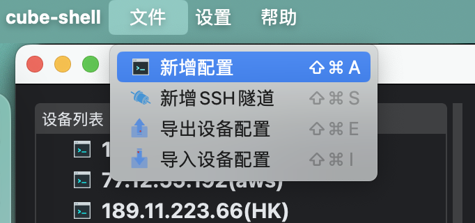
- 新增配置
- 新增SSH隧道
- 导出设备配置
- 导入设备配置


**3.支持sftp协议对文件的操作**

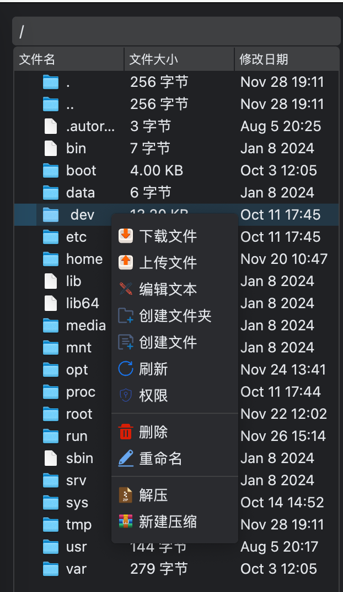
下载文件（支持批量下载）
- 上传文件（支持批量上传）
- 编辑文件
- 创建文件夹
- 创建文件
- 刷新（新增功能）
- 删除文件和文件夹（支持批量删除）

**4.支持ssh协议远程操作linux系统**

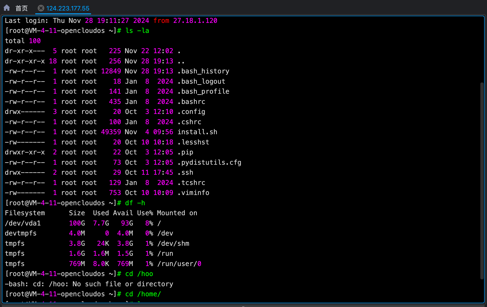

- 可以进行终端操作
- 支持多标签（支持相同服务器）
- 支持标签拖动顺序
- 支持复制、粘贴、清屏
- 代码高亮显示
- 支持切换终端主题
- 支持命令行补全功能
- 支持多标签之间终端和`sftp`文件区域联动


**5.主题切换**

`cube-shell 1.5.x`版本优化了具有现代化IDE风格的整体主题背景切换，依然支持两种主题切换，暗主题和亮主题两种
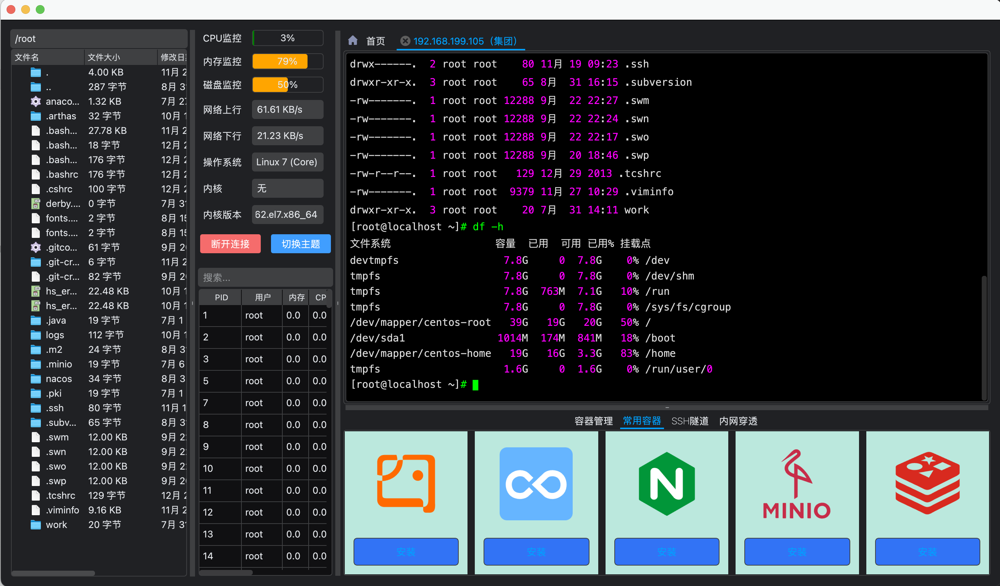
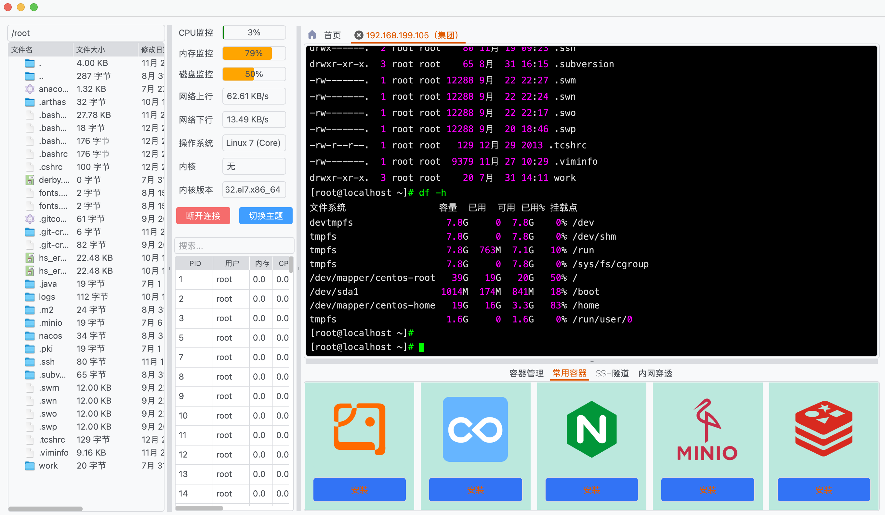

**6.状态栏**

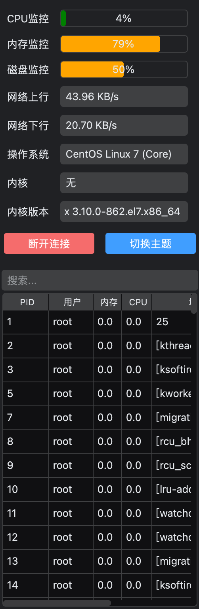
- CPU 监控
- 内存监控
- 磁盘监控
- 网络上行
- 网络下行
- 操作系统
- 内核
- 内核版本
- 进程管理（支持快速kill进程，支持进程搜索）

**7.扩展功能区**
- SSH隧道功能
  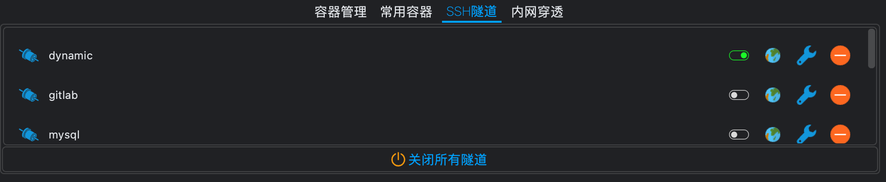
- 内网穿透功能
  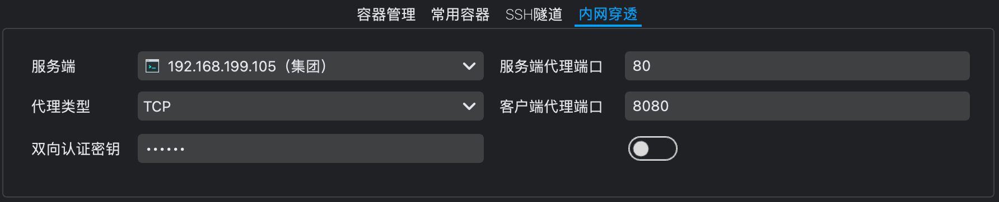
- 容器管理功能
  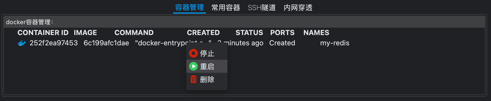
- 常用容器功能
  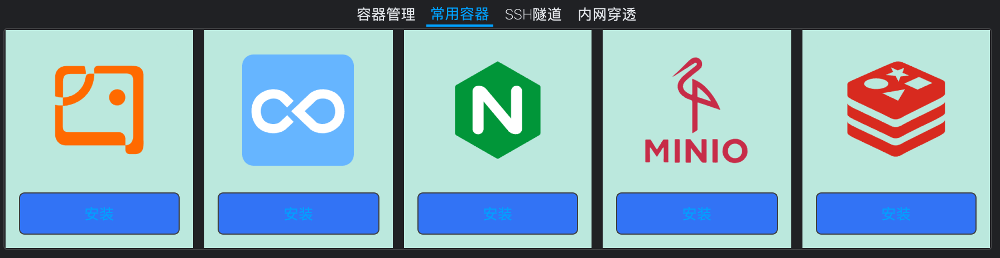


### 软件架构
`cube-shell`主要使用`python`语言开发。

主要使用技术：
|   名字  |  版本   |  描述   |
| --- | --- | --- |
|  Python   |  3.12.3   |     |
|  PySide6  |  6.7.2   |  是C++ Qt 的Python语言绑定，支持跨平台   |
|  paramiko   |  3.4.0   |  是python的操作ssh协议和sftp协议的第三方库   |
|  Pygments   |   2.18.0  |  是python代码高亮的常用库   |
|  pyqtdarktheme   |   2.1.0  |  是Qt现代主题库   |
|  deepdiff   |   8.0.1  |  python深度文件比对库   |
|  openai   |   2.37.0  |  AI大模型SDK   |
|  pyte   |   0.8.2  |  Linux终端数据流框架   |
|  frp   |   0.61.0  |  内网穿透套件   |

**图标主要来源以下两个图标库：**

`https://icons8.com/icons/color`

`https://www.iconfont.cn/`

#### 安装教程

可以直接下载 [Releases](https://github.com/Cubeiic-HanXuan/cube-shell/releases) 中最新发行版应用程序，也可以克隆源代码自行编译。

`cube-shell` 采用 [Nuitka](https://nuitka.net/) 将 Python 源码编译为原生二进制文件，性能提升约 50%，包体积减小约 40%。

##### 前置条件

| 条件 | 说明                                                                                     |
| --- |----------------------------------------------------------------------------------------|
| Python | **3.12** 或更高版本                                                                         |
| Git | 用于克隆仓库                                                                                 |
| C 编译工具链 | Windows 需要 MinGW64 或 MSVC；macOS 需要 Xcode Command Line Tools；Linux 需要 `build-essential` |
| 磁盘空间 | 建议至少预留 **2 GB**（编译过程会生成大量中间文件）                                                         |

##### 通用步骤（所有平台）

1. 克隆仓库

```bash
git clone https://github.com/Cubeiic-HanXuan/cube-shell.git
cd cube-shell
```

2. 创建并激活 Python 虚拟环境

```bash
python3 -m venv venv

# Linux / macOS
source venv/bin/activate

# Windows (PowerShell)
.\venv\Scripts\Activate.ps1
```

3. 安装项目依赖

```bash
pip install -r requirements.txt
```

##### 编译 Windows 程序

> 需要已安装 **MinGW64** 或 **MSVC** 编译器，以及 [Inno Setup](https://jrsoftware.org/isinfo.php)（用于打包安装程序）。

1. 编译为独立可执行程序

```bash
build-exe.bat
```

脚本会自动安装 Nuitka 并编译，产物位于 `deploy\cube-shell.dist\` 目录。

2. 打包为 EXE 安装包（可选）

```bash
deploy-install.bat
```

最终生成 Windows 安装程序（`.exe`），可分发给用户直接安装。

##### 编译 macOS 程序

> 需要已安装 **Xcode Command Line Tools** 以及 [create-dmg](https://github.com/create-dmg/create-dmg)（脚本会自动通过 Homebrew 安装）。

1. 赋予脚本执行权限并运行

```bash
chmod +x app.sh
./app.sh
```

脚本会自动完成 Nuitka 编译、资源拷贝、DMG 打包等步骤。

2. 产物说明

| 文件 | 说明 |
| --- | --- |
| `deploy/cube-shell.dmg` | macOS 磁盘映像安装包，双击挂载后拖入 Applications 即可使用 |

##### 编译 Linux (Ubuntu/Debian) 程序

> 适用于 Ubuntu / Debian 系发行版，脚本内置 `apt-get` 自动安装所需系统依赖。

1. 赋予脚本执行权限并运行

```bash
chmod +x build-linux.sh
./build-linux.sh
```

脚本会自动安装系统依赖（`patchelf`、`ccache`、Qt 运行库等）、编译应用、生成桌面入口文件和启动脚本。

2. 产物说明

| 文件 | 说明 |
| --- | --- |
| `deploy/cube-shell.dist/` | 完整的应用目录，可直接运行 `./cube-shell.sh` 启动 |
| `deploy/cube-shell-linux-x86_64.tar.gz` | 压缩发布包，可分发至其他机器解压使用 |
| `deploy/cube-shell.dist/cube-shell.desktop` | 桌面快捷方式文件，复制到 `~/.local/share/applications/` 后可在应用菜单中找到 |

#### 参与贡献
欢迎各位朋友积极参与代码贡献。

1.  Fork 本仓库
2.  新建 Feat_xxx 分支
3.  提交代码
4.  新建 Pull Request

#### 视频教程地址
[cube-shell-video](https://mp.weixin.qq.com/s/ntDuDipnCqN4v2Y4Urzo6w)

#### 有任何不懂的可以加交流群
<div>
<a target="_blank" href="https://qm.qq.com/q/VQJQlkmc4G">

</a>


</div>

[License-link]: https://github.com/Cubeiic-HanXuan/cube-shell/blob/master/LICENSE "License"
[License-badge]: https://img.shields.io/badge/License-LGPL%20v3-blue.svg "License"
[Python-link]: https://www.python.org/downloads/ "Python"
[Python-badge]: https://img.shields.io/badge/python-3.12+-blue.svg "Python"

[release-link]: https://github.com/Cubeiic-HanXuan/cube-shell/releases "Release status"
[release-link]: https://github.com/Cubeiic-HanXuan/cube-shell/releases "Release status"
[release-badge]: https://img.shields.io/github/release/Cubeiic-HanXuan/cube-shell.svg?style=flat-square "Release status"
[download-link]: https://github.com/Cubeiic-HanXuan/cube-shell/releases/latest "Download status"
[download-badge]: https://img.shields.io/github/downloads/Cubeiic-HanXuan/cube-shell/total.svg "Download status"
[download-latest]: https://img.shields.io/github/downloads/Cubeiic-HanXuan/cube-shell/latest/total.svg "latest status"